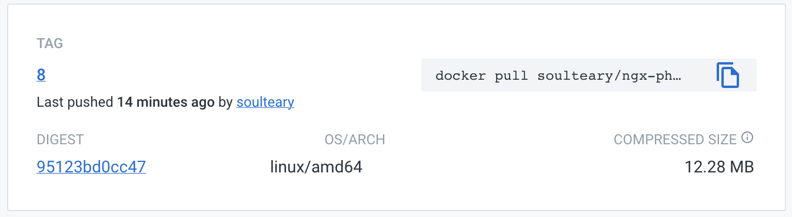
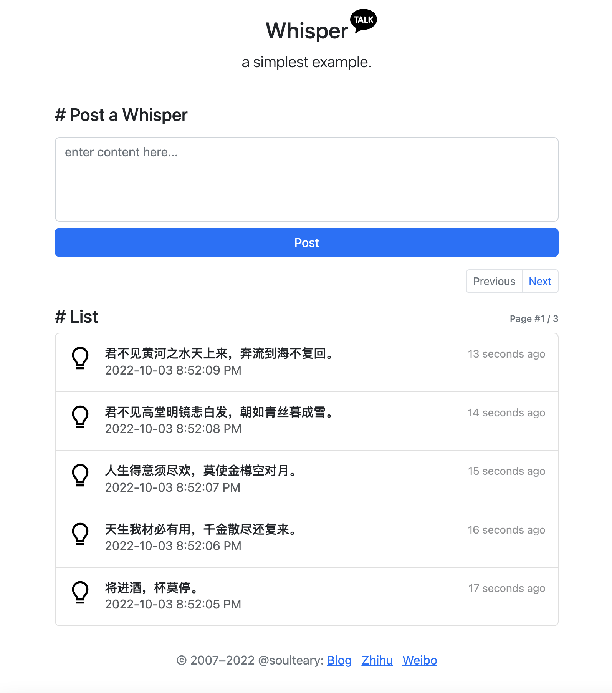

# Nginx NGX-PHP Module Demo (MicroBlog)

[English Ver](./README_EN.md)

使用 Nginx 模块 NGX-PHP 实现的一个简单的微博应用 Demo，不依赖 PHP-FPM 等技术栈，高效、安全、可靠。



基于 Nginx 官方容器构建，基础镜像仅 12MB。

## 界面预览



## 使用方法

启动容器：

```bash
docker run --rm -it -v `pwd`/data:/usr/share/nginx/html/data:rw -p 8090:80 soulteary/ngx-php:8-microblog
```

或者使用 `docker compose`:

```bash
docker-compose -f docker-compose.ngx-php.yml up
```

打开浏览器：`http://localhost:8090`


## 性能测试

对比 `soulteary/ngx-php:8` 和 `php:8.1.10-apache-buster`。

### soulteary/ngx-php:8

```bash
wrk -t16 -c 100 -d 30s http://127.0.0.1:8090     
Running 30s test @ http://127.0.0.1:8090
  16 threads and 100 connections
  Thread Stats   Avg      Stdev     Max   +/- Stdev
    Latency    94.01ms   15.94ms 431.01ms   81.62%
    Req/Sec    64.02     11.33   148.00     74.26%
  30715 requests in 30.09s, 65.03MB read
Requests/sec:   1020.65
Transfer/sec:      2.16MB
```

### php:8.1.10-apache-buster (`opcache.enable=1`)

```bash
wrk -t16 -c 100 -d 30s http://127.0.0.1:8090     
Running 30s test @ http://127.0.0.1:8090
  16 threads and 100 connections
  Thread Stats   Avg      Stdev     Max   +/- Stdev
    Latency   132.92ms  158.49ms   1.98s    86.67%
    Req/Sec    54.38     56.83   670.00     94.88%
  22603 requests in 30.08s, 49.40MB read
  Socket errors: connect 0, read 0, write 0, timeout 112
Requests/sec:    751.53
Transfer/sec:      1.64MB
```

## 相关项目

- Nginx 模块 NGX-PHP: [https://github.com/rryqszq4/ngx-php](https://github.com/rryqszq4/ngx-php)
- Nginx Docker 快速开发环境: [https://github.com/nginx-with-docker/nginx-docker-playground](https://github.com/nginx-with-docker/nginx-docker-playground)
- SVG 图标: [信息图标](https://www.iconfont.cn/collections/detail?cid=30328) [界面Logo](https://www.iconfont.cn/collections/detail?cid=36911)
- 前端框架 [Bootstrap](https://github.com/twbs)
- JavaScript 计算过去时间: [twas](https://github.com/vutran/twas)
